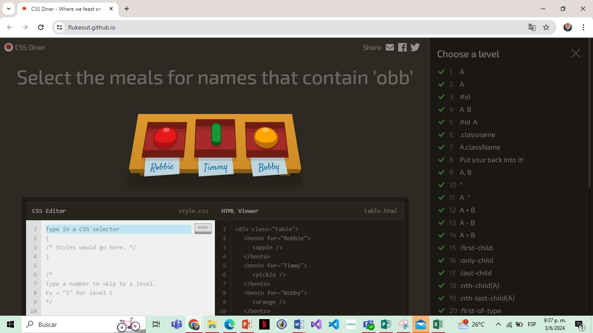
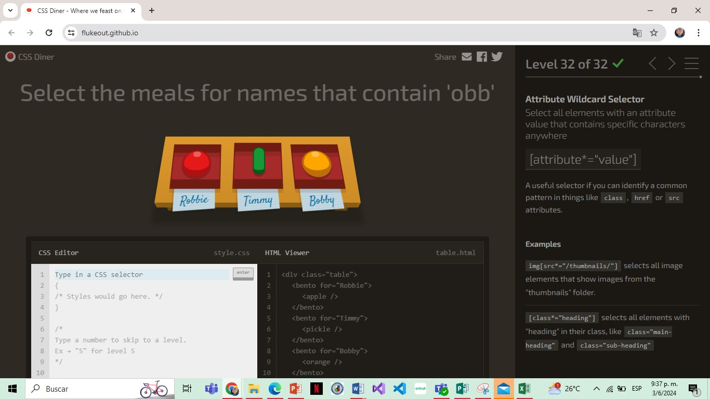

# CSS-Selectors-con-CSS-Diner
Tarea de Prog. Web

## Selector de tipo: 
  Descripción: Selecciona elementos por su tipo (etiqueta).
  Ejemplo: a selecciona todos los elementos <a> (enlaces).
  
## Selector de identificación: 
  Descripción:Selecciona elementos con un ID específico.
  Ejemplo: #header selecciona el elemento con id="header".
  
## Selector de descendientes: 
  Descripción: Selecciona un elemento dentro de otro elemento.
  Ejemplo: ul li selecciona todos los elementos li que se encuentran dentro de cualquier  ul.
  
## Combinación de selector de descendiente e ID: 
  Descripción: Puede combinar cualquier selector con el selector descendiente.
  Ejemplo: #menu ul selecciona todos los elementos ul que están dentro del elemento con id="menu".
  
## Selector de clases: 
  Descripción: Selecciona elementos por su clase.
  Ejemplo: .destacado selecciona todos los elementos con class="destacado".
  
## Selector universal: 
  Descripción:¡Puedes seleccionarlo todo!
  Ejemplo: * selecciona todos los elementos en el documento.
  
## Selector de hermanos generales: 
  Descripción: Selecciona elementos que siguen a otro elemento.
  Ejemplo: h2 ~ p selecciona todos los elementos p que siguen a un elemento h2.

## Selector de atributo comodín: 
  Descripción: Selecciona todos los elementos con un valor de atributo que contiene caracteres específicos en cualquier lugar.
  Ejemplo: [title*="tutorial"] selecciona todos los elementos con un atributo title que contenga la palabra "tutorial".

## Selector de atributo que termina con: 
  Descripción: Selecciona todos los elementos con un valor de atributo que termina con caracteres específicos.
  Ejemplo: [href$=".pdf"] selecciona todos los elementos con un atributo href que termine en ".pdf".

## Selector de atributo que empieza con:
  Descripción: Selecciona todos los elementos con un valor de atributo que empieza con caracteres específicos.
  Ejemplo: [src^="https://"] selecciona todos los elementos con un atributo src que empiece con "https://".

## Selector de valor de atributo: 
  Descripción: Selecciona todos los elementos que tienen un valor de atributo específico.
  Ejemplo: [type="email"] selecciona todos los elementos con un atributo type igual a "email".
  
  
